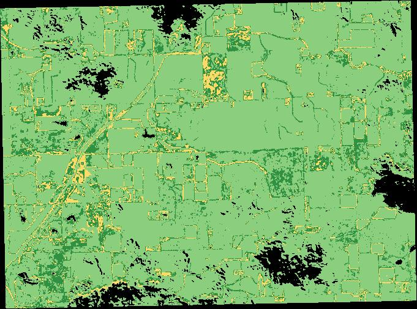

# SIP MOISTURE ANOMALY
Some brief summary should be here

## Build image
`docker build -t quantumobile/sip_moisture_anomaly .`

## Pull image
`docker pull quantumobile/sip_moisture_anomaly`

## Push to registry
`docker push quantumobile/sip_moisture_anomaly`

## Docker run command

```
docker run \
    -e "AOI=POLYGON((-85.31589029977734 40.37835374310216,-85.2369260663789 40.37835374310216,-85.2369260663789 40.334139412509636,-85.31589029977734 40.334139412509636,-85.31589029977734 40.37835374310216))" \
    -e "START_DATE=2019-05-01" \
    -e "END_DATE=2019-08-30" \
    -e "SENTINEL2_CACHE=/input/SENTINEL2_CACHE" \
    -e "OUTPUT_FOLDER=/output" \
    -e "SENTINEL2_GOOGLE_API_KEY=/input/api-key-retriever.json" \
    -v `pwd`/api-key-retriever.json:/input/api-key-retriever.json \
    -v `pwd`/data/SENTINEL2_CACHE:/input/SENTINEL2_CACHE \
    -v `pwd`/data/results:/output \
    quantumobile/sip_moisture_anomaly
```

## Example result




## How to add model to SIP
____

1. Open Admin page, `localhost:9000/admin/`
2. In AOI block select `Components` and click on `+Add`
    * Add <b>Component name</b>: `Add your name`
    * Add <b>Image</b>: `quantumobile/sip_moisture_anomaly`
    * Select <b>Sentinel Google API key is required</b>
    * Deselect <b>GPU is needed for a component to run</b>
3. <b>SAVE</b>
4. Update page with `SIP app` <i>(localhost:3000)</i>
5. Select `Area` or `Field` on the map and save it
6. Drop-down menu on your `Area` or `Field` -> `View reports`
7. `Create new`
8. In `Select layers` choose your component, add additional params like <i>Year</i>, <i>Date range</i> and so on
9. `Save changes`

